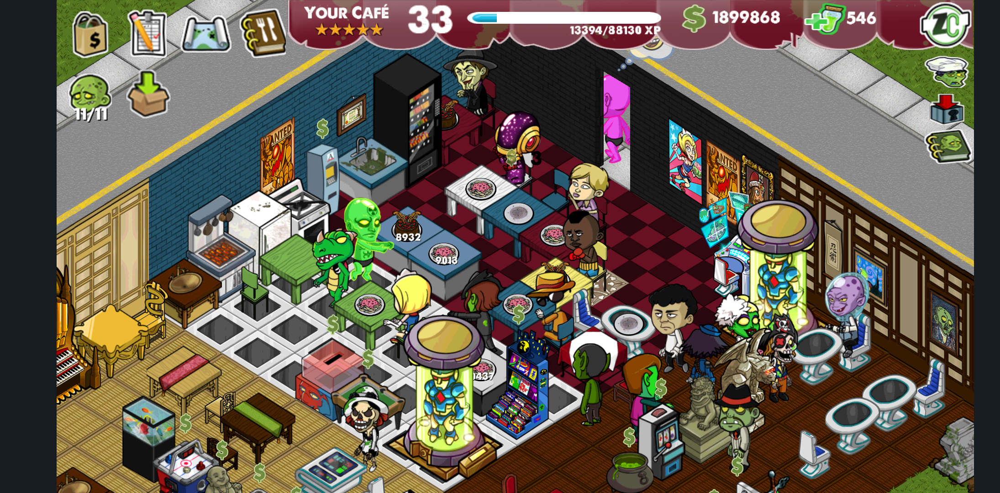

# Zombie Cafe Revival

An ongoing effort to reverse engineer, preserve, and revive the 2011 Capcom mobile game *Zombie Cafe* — replacing the shut-down online services, fixing long-standing crashes, and eventually rebuilding the client as a cross-platform game in **Godot 4**.

## Heritage

This repository began as the work of [**Airyz**](https://airyz.xyz/), who did the original reverse engineering: decoding the proprietary file formats (save games, character data, the `CCTX` texture format), authoring the `LibZombieCafeExtension` runtime patcher that rewrites `libZombieCafeAndroid.so` in memory at load time, and standing up a Cloudflare Workers backend that emulates Capcom's retired `/v1/zca/*` endpoints. Airyz's write-up is the single best primer on the project's technical foundations:

> https://airyz.xyz/p/zombie-cafe-revival/

Everything in this repo up to and including commit [`712edb8f`](../../commit/712edb8f) is a direct continuation of Airyz's work, and the file formats, patch offsets, and server shape documented there remain the source of truth for the current Android build.

## Current maintainer

This fork is maintained by **Edward Yang** ([@edbuildingstuff](https://github.com/edbuildingstuff)). Edward's role is to take the project's next step: moving from *"patched original APK running only on 32-bit ARM Android"* to a **cross-platform Godot 4 client** that reuses the existing Go asset pipeline, binary format definitions, and server backend. Airyz's prior contributions are preserved and credited throughout; the Godot rewrite is a new direction layered on top, not a replacement of that history.

## Where the project is today



*v1.1.0 running on a Samsung Note 20 Ultra (Android 13): level-33 cafe, 546 toxin (slot-picker IAP bypass working), restored character SFX, no native crashes.*

The existing Android build is functional and playable:

- The original `libZombieCafeAndroid.so` (~1.9 MB, `armeabi-v7a`) is left untouched on disk. At process startup, `LibZombieCafeExtension` is loaded alongside it and uses `mprotect` + memcpy to rewrite a handful of byte ranges — fixing a texture destructor crash, redirecting the game's hardcoded server URLs to `zc.airyz.xyz`, swapping the "money buy" button to "toxin buy," and patching the version string.
- A Go workspace under [`tool/`](tool/) contains five packages: `build_tool` (orchestrates the APK rebuild), `file_types` (binary format definitions for save games, cafes, characters, food, furniture, animations), `cctpacker` (CCTX texture codec), `resource_manager` (JSON ↔ binary round-tripping + atlas packing), and `server` (Cloudflare Workers backend).
- The APK is repackaged with `apktool`, signed with the bundled `debug.keystore`, and installed on device.

**Known limitations inherited from this approach** (all documented in [`docs/rewrite-plan.md`](docs/rewrite-plan.md)):

- ARMv7 32-bit only — no iOS, desktop, or web.
- Texture destructors are NOPed out to avoid the original crash, leaking a small amount of memory per unload.
- The engine hardcodes 2 character sheets, which blocks backporting the full Japanese character roster.
- The animation format has been decoded but is not yet re-packed by the tooling.
- `/v1/zca/savegamestate.php` intentionally drops ~90% of writes as a cost-control measure.

## Direction: Godot 4 cross-platform client

After weighing the options — emulating the existing ARM binary, statically decompiling it into portable C++, or rewriting the client on top of a modern engine — we're committing to the **Godot 4 remake** path. The short version of the reasoning:

- Godot handles 2D sprite games of this scale effortlessly and exports to Windows, macOS, Linux, iOS, Android, and the web from a single codebase.
- The Go tooling in `tool/file_types`, `tool/cctpacker`, and `tool/resource_manager` already solves the hard part — reading and writing Zombie Cafe's custom binary formats — so the Godot client can consume assets through an import pipeline instead of re-deriving any of that work.
- The Cloudflare Workers server stays as-is. It's already platform-agnostic.
- Runtime patching and the smali shell go away entirely once a Godot boot path exists, which removes the memory leak, the ARMv7 lock-in, and the 2-character-sheet ceiling in one stroke.

Full reasoning, trade-offs, phased plan, and validation strategy live in [`docs/rewrite-plan.md`](docs/rewrite-plan.md).

## Documentation

- [`docs/rewrite-plan.md`](docs/rewrite-plan.md) — the Godot rewrite plan: goals, scope, phases, validation harness, and the decision log for why this path over the alternatives.
- [`docs/devlog/`](docs/devlog/) — dated development journal entries. Written as the work happens, intended as source material for future blog posts and write-ups.
- [`src/lib/cpp/README.md`](src/lib/cpp/README.md) — build commands for the legacy `LibZombieCafeExtension` runtime patcher.
- [`tool/cctpacker/readme.md`](tool/cctpacker/readme.md), [`tool/resource_manager/README.md`](tool/resource_manager/README.md) — notes on the Go tools.

## Building the legacy Android APK

These instructions still work and are the reference path until the Godot client lands. They assume `cmake`, `make`, `go`, `apktool`, `jarsigner`, and the Android NDK are installed and on `PATH`.

### 1. Build `LibZombieCafeExtension`

```bash
cd src/lib/cpp
mkdir build
cd build
cmake ../ -DCMAKE_TOOLCHAIN_FILE=$NDK_HOME/build/cmake/android.toolchain.cmake -DANDROID_ABI=armeabi-v7a -DANDROID_PLATFORM=android-8
make
```

### 2. Run the Go build tool, assemble, sign, install

```bash
go run ./tool/build_tool/ -i src/ -o build/

cp src/lib/cpp/build/libZombieCafeExtension.so ./build/lib/armeabi/libZombieCafeExtension.so

apktool b ./build -o ./build/out/out.apk

jarsigner -verbose -sigalg SHA1withRSA -digestalg SHA1 -keystore debug.keystore -storepass zombiecafe ./build/out/out.apk alias_name

adb install ./build/out/out.apk
```

## Legal and attribution

*Zombie Cafe* is copyright Capcom. This is a non-commercial reverse engineering, preservation, and revival project; no original game assets are redistributed by this repository beyond what is necessary for the build pipeline to operate on a legitimately obtained APK. If you represent Capcom and have concerns about any specific file in this tree, please open an issue and it will be addressed promptly.

Credit for the original reverse engineering — the hex-level work, the server protocol recovery, the runtime patch design — belongs to Airyz. Edward Yang is responsible for the Godot rewrite direction and any new content added after the fork point.
